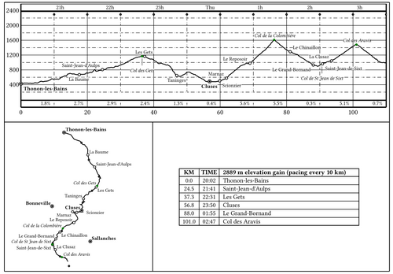

# WPX 

This tool is designed for **brevet cycling**. Starting from brevet GPX files, it does two things:

  * **Generate a PDF file** containing elevation profiles, maps, and a table of important points (controls). You can print this PDF to take on the ride as a *feuille de route* (cue sheet).
  * **Generate pacing points.** These are waypoints placed at regular intervals (e.g., every 10 km or every 250 m of elevation gain). Each waypoint is labeled with its closing time and the average slope to that point: "12:34-5.1%", for example. When displayed as "Next Waypoint" on your GPS, it helps you estimate your time on hand.

During the ride, your GPS provides local directions, while the *feuille de route* tells you:

  - Where am I on a regional scale (cities/villages)?
  - What difficulties are ahead (distance/elevation)?
  - How much time on hand do I have left?
  
Here is a screenshot of a [sample pdf](backend/pdf/alpes.pdf):



As opposed to many other tools, WPX does not fetch pre-rendered tiles, it renders the map on-the-fly using the gpx track and OSM points.

WPX can be used:
- [online](https://vps-e637d6c5.vps.ovh.net:8123) ([documentation](./frontend/ui/README.md)) 
- from the [command line](./backend/CLI.md)) 

## Input

  - WPX can load multiple GPX files and reads all tracks and segments. **Control points** are determined by the end of segments. If a waypoint exists near a segment end, its name and description are used for that control.
  - Elevation gain is computed using a 200m moving average on the GPX data. This is sufficient for identifying the hilliest sections, but do not expect perfect absolute accuracy.
  - Cities and villages are downloaded from [OSM data](https://wiki.openstreetmap.org/wiki/Overpass_API) based on the track's bounding box. If the download fails (common with very long tracks), please retry.

## Output

WPX generates a zip file containing the PDF and the following GPX files:
  - `flat-track.gpx`: The complete track without elevation data. This prevents devices like the Garmin eTrex from automatically generating "high/low" waypoints.
  - `flat-segment-<n>.gpx`: Individual segments, from one control to the next, without elevation data.
  - `pacing-all.gpx`: All pacing points in a single file.
  - `pacing-<n>.gpx`: Pacing points separated to avoid ambiguity. GPS devices determine the "Next Waypoint" based on geographic proximity. For an out-and-back tour (like Paris-Brest-Paris), pacing points belonging to the return leg might show up during the outbound leg if they are all loaded at once. Loading `pacing-1.gpx` on the way out, and `pacing-2.gpx` on the way back works around that problem.

For example, for a brevet with 7 controls, the output might contain:

```
$ unzip -l /tmp/foo.zip 
[...]
   114734  2024-01-01 00:00   flat-segment-01.gpx
   198644  2024-01-01 00:00   flat-segment-02.gpx
    71852  2024-01-01 00:00   flat-segment-03.gpx
    34066  2024-01-01 00:00   flat-segment-04.gpx
    61081  2024-01-01 00:00   flat-segment-05.gpx
    60580  2024-01-01 00:00   flat-segment-06.gpx
    38897  2024-01-01 00:00   flat-segment-07.gpx
   578411  2024-01-01 00:00   flat-track.gpx
     5033  2024-01-01 00:00   pacing-1.gpx
      539  2024-01-01 00:00   pacing-2.gpx
     5424  2024-01-01 00:00   pacing-all.gpx
   356943  2024-01-01 00:00   route.pdf
```

---- 

## Directory Structure 

The project consists of two parts:

  * A [backend](./backend) written in Rust. It contains algorithm to read/write gpx files, computes the profiles, the maps, assembles the pdf. 
  * A [frontend](./frontend/ui) written in Flutter. This is the code for the UI. 

They communicate via [flutter\_rust\_bridge](https://cjycode.com/flutter_rust_bridge/). I started this project to learn Rust and Flutter; this is my first project in both languages.

## HOW TO BUILD

Assuming a working Rust and Flutter toolchain:

```
cd frontend/ui
cargo install flutter_rust_bridge_codegen
flutter_rust_bridge_codegen generate
flutter build linux
```
