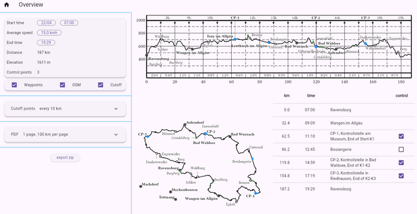
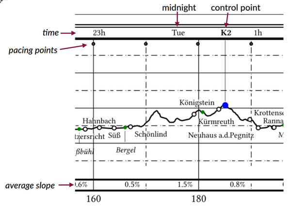

# WPX 

WPX is a tool for long-distance cycling, especially brevet/randonneuring. It generates printable route PDFs with elevation profiles, maps, and control points from GPX tracks.



Try it online: [julien5.dev/wpx](https://www.julien5.dev/wpx):
- No installation required.
- **[User manual](./docs/UI.md)**
- Best used on desktop (mobile works, but some features are not yet available).

Source code on [github](https://github.com/Julien5/wpx).

## What is it?

Used *before* the ride, WPX reads GPX files and does two things:

  * **Generate a PDF file** containing elevation profiles, maps, and a table of important points (controls). Print this PDF to take on the ride. Paper is lightweight, does not run out of battery, and has a larger display than a mobile phone.  Here is a screenshot of a [sample pdf](docs/sample/alpes.pdf):

    

    During the ride, your GPS provides local directions, while this PDF tells you:

    - Where am I on a regional scale? What are the cities/villages around?
    - What elevation gain and slope is ahead?
    - How much time on hand do I have left?

    Unlike tools that rely on pre-rendered tiles, WPX renders the map on the fly using the GPX track and OSM points.

  * **Generate cutoff points.** These are waypoints placed at regular intervals (e.g., every 10 km or every 250 m of elevation gain). Each waypoint is labeled with its closing time and the average slope to that point: `12:34-5.1%`, for example. Displayed as "Next Waypoint" on your GPS, they help you estimate your time on hand.
  
#### Notes on the PDF

* The elevation profile has a header with the cutoff time and the control points.



   * WPX tries to display the same labels on the map as on the elevation profile. However, it may fail to find positions where labels do not overlap the track or other points. In that case, OSM points are omitted; this is why you might see points on the elevation profile but not on the map. GPX waypoints, on the other hand, are still shown even if they overlap.
   
   * The table lists controls, waypoints, and selected OSM points. Cutoff points are not included. Only the most important OSM points are shown, based on population and proximity to other points, in order to maintain an even spatial distribution.

## Input

* The GPX file must have elevation data.

* WPX loads one or multiple GPX files and reads all tracks and segments. **Control points** are determined by the ends of segments. If a waypoint exists near a segment end, its name and description are used for that control. Additionally, the [UI](./docs/UI.md) supports converting waypoints into control points.

* Cities and villages are downloaded from [OSM data](https://wiki.openstreetmap.org/wiki/Overpass_API) based on the track's bounding box. If the download fails, which common with very long tracks, please retry (the UI retries automatically).

*Note: Elevation gain is computed using a 200 m moving average on the GPX data. This is sufficient for identifying the hilliest sections, but do not expect perfect absolute accuracy.*

## Output

### Zip File 

WPX generates a zip file containing the PDF and the following GPX files:

| filename                   | description                                                                                   |
|----------------------------|-----------------------------------------------------------------------------------------------|
| `track-waypoints.gpx`      | Individual segments, from one control to the next, and the waypoints. Useful as input to WPX. |
| `flat-segment-<n>.gpx`     | Individual segments, from one control to the next, without elevation data.                    |
| `elevated-segment-<n>.gpx` | Individual segments, from one control to the next, with elevation data.                       |
| `cutoff-all.gpx`           | All cutoff points in a single file.                                                           |
| `cutoff-<n>.gpx`           | Cutoff points separated to avoid ambiguity.                                                   |

The "flat" segments without elevation data are useful to prevent devices like the Garmin eTrex from automatically generating "high/low" waypoints.

*Note on cutoff point files*: 

GPS devices determine the "Next Waypoint" based on geographic proximity. For an out-and-back route (like Paris-Brest-Paris), your device might mistakenly show a point from the return journey while you are still on the outward journey. Loading `cutoff-1.gpx`  at the start, and `cutoff-2.gpx` on the way back works around that problem. 
But mid-ride file transfers are a gamble you don't want to take with frozen fingers or a dying battery. You can choose your preferred strategy, using either `cutoff-all.gpx` or the separated `cutoff-1.gpx` and `cutoff-2.gpx`.

----

## HOW TO BUILD

### Command Line 

```
cd backend 
cargo build 
```
See [CLI notes](./docs/CLI.md).

### Flutter application 

Assuming working Rust and Flutter toolchains:
```
cd frontend/ui
cargo install flutter_rust_bridge_codegen
flutter_rust_bridge_codegen generate
flutter build linux
```
This is the application that is served at [julien5.dev/wpx](https://www.julien5.dev/wpx).
See [UI notes](./docs/UI.md).

----

## Directories

The project consists of two parts:

  * A [backend](./backend) written in Rust. It contains algorithm to read/write gpx files, computes the profiles, the maps, assembles the pdf. The map and profile are serialized as svg documents.
  * A [frontend](./frontend/ui) written in Flutter. This is the code for the UI. 

They communicate via [flutter\_rust\_bridge](https://cjycode.com/flutter_rust_bridge/). I started this project to learn Rust and Flutter; this is my first project in both languages.

