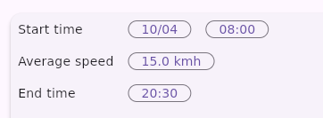
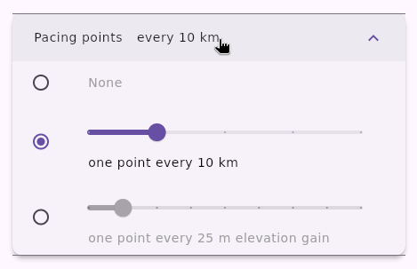

# WPX TOOL

This tool is designed for brevet cycling. Starting from brevet GPX files, it does two things:

* **Generate a PDF file** containing elevation profiles, maps, and a table of important points (controls). You can print this PDF to take on the ride. Let's call this a *feuille de route*.
* **Generate pacing points.** These are waypoints placed at regular intervals (e.g., every 10 km or every 250 m of elevation gain). Each waypoint is labeled with its closing time and the average slop to that point: "12:34-5.1%", for example. When displayed as "Next Waypoint" on your GPS, it helps you estimate your time buffer. 


During the ride, your GPS provides local directions, while the *feuille de route* tells you:
- Where am I on a regional scale (cities/villages)?
- What difficulties are ahead (distance/elevation)? 
- How much time do I have left?

---

## How to use

### Load GPX files 


WPX can load multiple GPX files and reads all tracks and segments. **Control points** are determined by the end of segments. If a waypoint exists near a segment end, its name and description are used for that control.

Elevation gain is computed using a 200-m moving average on the GPX data. This is sufficient for identifying the hilliest sections of a brevet, but do not expect perfect absolute accuracy. 

Cities and villages are downloaded from [OSM data](https://wiki.openstreetmap.org/wiki/Overpass_API) based on the track's bounding box. If the download fails (common with very long tracks), please retry:


### Set time parameters

- **Start Time:** Set the date and time. Accurate start date help label the days correctly on the elevation profile for rides passing midnight. 
- **Speed:** Currently, only constant speed is supported. This is generally sufficient for brevets up to 600km per ACP rules.
- **End Time:** This can be adjusted to match the official brevet cutoff. This will recalculate the average speed accordingly.



*Note: The computed closing times for each control may not perfectly match the official organization times, but they should be quite close.*

### Choose point types


- **Controls:** Points found at segment ends.
- **Waypoints:** Original waypoints from the input GPX. If a waypoint matches a control point, it is merged into the control (and not shown as waypoint).
- **OSM:** Names of cities, villages, and mountain passes. Only the most important OSM points are shown to keep the table readable (filtered by a minimum distance of 10% of the track/page length).
- **Pacing:** These are shown as dots on the elevation profile and map, but not in the tables. 

### Pacing points



### PDF

- Because two segments are printed on a single A4 page, you can select the number of pages as 0.5, 1, 1.5, etc. 
- WPX tries to generate segments covering round distances (like 100km) with a 10% overlap. Because of these constraints, the slider may not offer all page counts (e.g., 0.5, 1, 1.5, 2, and 4, but not 3 pages).


### ZIP export 

"zip export" generates:
- **Flat tracks:** GPX tracks without elevation data. This prevents devices like the Garmin eTrex from automatically generating "high/low" waypoints.
- **pacing-all.gpx:** All pacing points in one file.
- **pacing-1, 2, etc.:** Split pacing points to avoid device ambiguity.
- **The PDF.**

---

## Project Architecture

The project consists of two parts:
* A **backend** written in Rust (`/backend`).
* A **frontend** written in Flutter (`/frontend/ui`).

They communicate via [flutter_rust_bridge](https://cjycode.com/flutter_rust_bridge/). I started this project to learn Rust and Flutter; for both languages, this is my first project. 

## HOW TO BUILD

Assuming a working Rust and Flutter toolchain:
```
cd frontend/ui
cargo install flutter_rust_bridge_codegen
flutter_rust_bridge_codegen generate
flutter build linux
```
