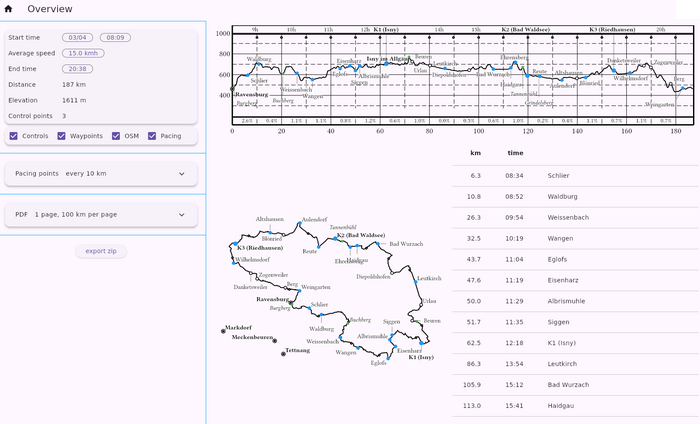

# WPX TOOL

This tool is designed for **brevet cycling**. Starting from brevet GPX files, it does two things:

  * **Generate a PDF file** containing elevation profiles, maps, and a table of important points (controls). You can print this PDF to take on the ride as a *feuille de route* (cue sheet).
  * **Generate pacing points.** These are waypoints placed at regular intervals (e.g., every 10 km or every 250 m of elevation gain). Each waypoint is labeled with its closing time and the average slope to that point: "12:34-5.1%", for example. When displayed as "Next Waypoint" on your GPS, it helps you manage your time buffer.

During the ride, your GPS provides local directions, while the *feuille de route* tells you:

  - Where am I on a regional scale (cities/villages)?
  - What difficulties are ahead (distance/elevation)?
  - How much time do I have left?
  
WPX can be used with a graphical interface or from the command line.  

-----

## Graphical Interface



### Set Time Parameters

  - **Start Time:** Set the date and time. An accurate start date helps label the days correctly on the elevation profile for rides passing midnight.
  - **Speed:** Currently, only constant speed is supported. This is generally sufficient for brevets up to 600km per ACP rules.
  - **End Time:** This can be adjusted to match the official brevet cutoff. This will recalculate the average speed accordingly.

*Note: The computed closing times for each control may not perfectly match the official organization times, but they should be very close.*

### Choose Point Types

  - **Controls:** Points found at the ends of segments.
  - **Waypoints:** Original waypoints from the input GPX. If a waypoint matches a control point, it is merged into the control (and not shown as a separate waypoint).
  - **OSM:** Names of cities, villages, and mountain passes. Only the most important OSM points are shown to keep the table readable (filtered by a minimum distance of 10% of the track/page length).
  - **Pacing:** These are shown as dots on the elevation profile and map, but are excluded from the tables.

### PDF

  - Since two segments are printed on a single A4 page, you can select the number of pages in increments of 0.5 (e.g., 0.5, 1, 1.5, etc.).
  - WPX attempts to generate segments covering round distances (like 100km) with a 10% overlap. Due to these constraints, the slider does not offer every page count.

-----

## Command Line

With the default arguments on `alpes.gpx`, this results in [this PDF](./backend/pdf/alpes.pdf).

```bash
wpx data/ref/alpes.gpx --output pdf/alpes.pdf
```
.

### Input

WPX can load multiple GPX files and reads all tracks and segments. **Control points** are determined by the end of segments. If a waypoint exists near a segment end, its name and description are used for that control.

Elevation gain is computed using a 200m moving average on the GPX data. This is sufficient for identifying the hilliest sections of a brevet, but do not expect perfect absolute accuracy.

Cities and villages are downloaded from [OSM data](https://wiki.openstreetmap.org/wiki/Overpass_API) based on the track's bounding box. If the download fails (common with very long tracks), please retry.

### Output

WPX generates either a standalone PDF file or a ZIP file containing:

  - **The PDF.**
  - **Flat track:** The complete track without elevation data. This prevents devices like the Garmin eTrex from automatically generating "high/low" waypoints.
  - **Flat segments:** Individual segments without elevation data.
  - **pacing-all.gpx:** All pacing points in a single file.
  - **pacing-1, pacing-2, etc.:** Pacing points separated to avoid ambiguity. GPS devices determine the "Next Waypoint" based on geographic proximity. For an **out-and-back** tour (like Paris-Brest-Paris), pacing points belonging to the return leg might show up during the outbound leg if they are all loaded at once. Load `pacing-1.gpx` on the way out, and `pacing-2.gpx` on the way back.

For example, for a brevet with 7 controls, the output might contain:

```
$ unzip -l /tmp/foo.zip 
Archive:  /tmp/foo.zip
  Length      Date    Time    Name
---------  ---------- -----   ----
   114734  2024-01-01 00:00   flat-segment-01.gpx
   198644  2024-01-01 00:00   flat-segment-02.gpx
    71852  2024-01-01 00:00   flat-segment-03.gpx
    34066  2024-01-01 00:00   flat-segment-04.gpx
    61081  2024-01-01 00:00   flat-segment-05.gpx
    60580  2024-01-01 00:00   flat-segment-06.gpx
    38897  2024-01-01 00:00   flat-segment-07.gpx
   578411  2024-01-01 00:00   flat-track.gpx
     5033  2024-01-01 00:00   pacing-1.gpx
      539  2024-01-01 00:00   pacing-2.gpx
     5424  2024-01-01 00:00   pacing-all.gpx
   356943  2024-01-01 00:00   route.pdf
---------                     -------
  1526204                     12 files
```

-----

## Project Architecture

The project consists of two parts:

  * A **backend** written in Rust (`backend/`).
  * A **frontend** written in Flutter (`frontend/ui/`).

They communicate via [flutter\_rust\_bridge](https://cjycode.com/flutter_rust_bridge/). I started this project to learn Rust and Flutter; this is my first project in both languages.

## HOW TO BUILD

Assuming a working Rust and Flutter toolchain:

```bash
cd frontend/ui
cargo install flutter_rust_bridge_codegen
flutter_rust_bridge_codegen generate
flutter build linux
```
