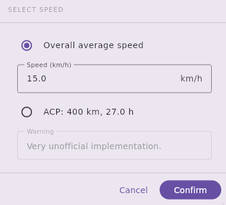
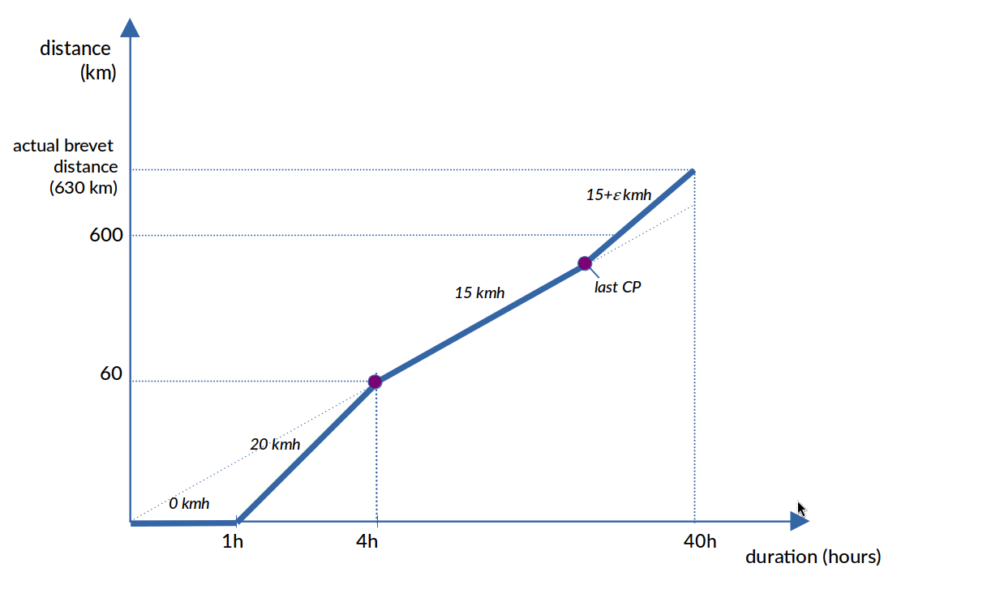
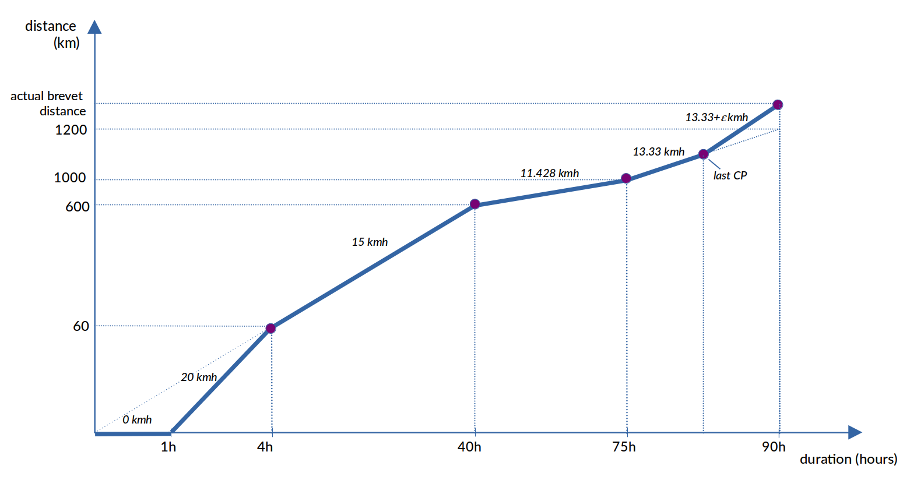
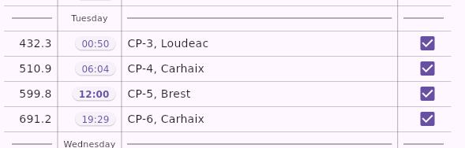
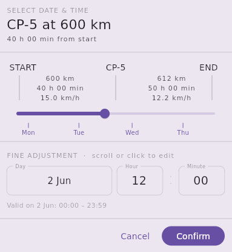
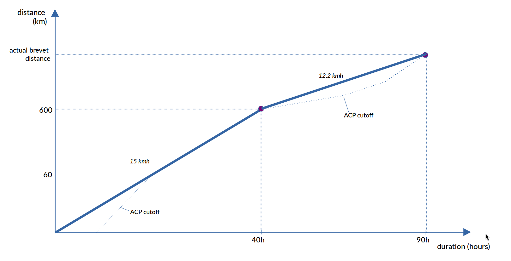

# WPX Frontend

### Set Time Parameters

- **Start Time:** Set the start date and time. An accurate start date ensures that days are labelled correctly on the elevation profile for rides that continue past midnight.
- **Speed:** The speed parameter controls the cutoff-time calculation. The default value is 15.0 km/h.
- **End Time:** This can be adjusted to match the official brevet cutoff. The average speed is then recalculated automatically.

*Note: Computed control closing times may not exactly match the official organizer-provided times, but they should be quite close.*

#### Speed / Cutoff Times

Cutoff times are calculated using the selected speed model.

Two options are available:

- **User-defined average speed:** Any value between 1 and 100 km/h can be specified.
- **ACP rules:** Available when the total distance is within 50 km of a nominal brevet distance (200, 300, 400, 600, 1000, or 1200 km). This option appliesthe [ACP (Audax Club Parisien) rules](https://www.audax-club-parisien.com/wp-content/uploads/2024/01/Rules-for-rider-2024.pdf). 
- **LRM rules:** Available for rides longer than 1200 km. This option applies the [LRM (Les Randonneurs Mondiaux) rules](https://www.randonneursmondiaux.org/files/Rules_2019.pdf).

#### ACP Rules

The ACP rules are defined for rides up to 1000 km, with a specific extension for Paris–Brest–Paris (PBP).

They look simple at first sight ("15 kmh up to 600 km") but they are full of surprises. 

- The start control has a closing time of one hour after the official start.
- The speed used between 1000 km and 1200 km is 13.33 km/h, which is higher than the speed used between 600 km and 1000 km. A rider following the ACP schedule is therefore expected to ride faster during the final 200 km of PBP.
- Because the actual distance of a brevet usually differs from its nominal distance, the effective speed required between the last control and the finish can be significantly different from the nominal ACP speed.

Example: Consider a 630 km brevet with a nominal distance of 600 km and a last control at 570 km.

- The final control closes after 570 / 15 = 38 hours.
- The brevet finish closes after 40 hours.

   The final 60 km must therefore be completed within 2 hours, corresponding to an average speed of 30 km/h. A rider arriving at the final control with one hour in hand would have a total of 3 hours to complete the remaining 60 km.

The following diagram summarizes the ACP rules for a 600 km brevet with an actual distance of 630 km:

The following diagram summarizes the ACP rules for a 1200 km brevet with an actual distance of 1230 km:

As you see, ACP closing times are not always suitable for pacing strategy. The ACP option may be rather be used for comparison purposes.

#### LRM Rules

The LRM rules apply to rides longer than 1200 km.

They are simpler than the ACP rules and just define a fixed overall average speed:

- 1200-1299 km: 13.33 km/h
- 1300-1899 km: 12 km/h
- 1900-2499 km: 10 km/h
- 2500 km and above: 200 km per day

For a 1200 km brevet using LRM rules, a control point at 600 km would close after 45 hours.

### Custom Control Cutoffs

When a user-defined average speed is selected (first option in the speed dialog), individual control closing times can be set. This can be useful when a simpler and more predictable pacing model is preferred over the ACP rules or to model an individual pacing strategy.  Example using a PBP route:

1. Set the speed to 13.35 km/h.
2. Adjust the end time to obtain a total duration of 90 hours.
3. Click the control-time button:

This opens the control-time dialog:

The dialog allows individual control cutoffs to be modified.

The Brest control is assigned a cutoff of 40 hours, while all other controls are distributed evenly. This results in arrival targets that are slightly earlier than the official ACP closing times:

Control times can also be customized to match an individual pacing strategy.

### Choose Point Types

- **Waypoints:** Original waypoints from the input GPX file. If a waypoint coincides with a control point, it is merged into the control and is not displayed separately. Waypoints can be converted into controls using the control checkbox in the overview table (only on desktop).
- **OSM:** Names of cities, villages, and mountain passes are derived from OpenStreetMap data. To maintain readability, only the most significant OSM points are displayed. A minimum spacing of 10% of the track/page length is applied.
- **Cutoff:** Cutoff markers are displayed on the map and elevation profile but are excluded from the tables.

### PDF Export

- Because two segments are printed on a single A4 page, the number of pages can be selected in increments of 0.5 (for example: 0.5, 1.0, 1.5, etc.).
- WPX attempts to generate segments with rounded distances (for example, 100 km) while maintaining approximately 10% overlap between adjacent segments. Due to these constraints, not every page count is available through the slider.
